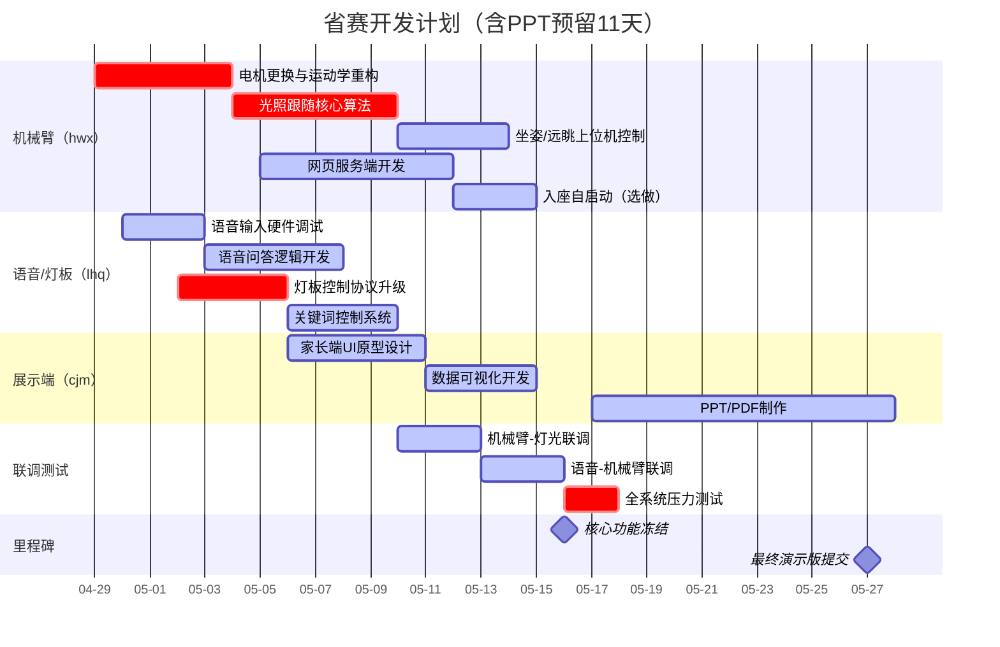

# Lampbot 省赛项目初期规划
___
## 1. 核心需求清单
| 需求                     | 负责人 | 必要性 |
|------------------------|-----|-----|
| 机械臂电机/模型更新             | hwx | 必做  |
| 机械臂光照跟随                | hwx | 必做  | 
| 坐姿提醒，远眺提醒的上位机控制        | hwx | 必做  |
| 网页服务器，网页端控制            | hwx | 必做  |
| 入座自启动+上位机控制            | hwx | 选做  |
| 语音输入+问答                | lhq | 必做  |
| 语音关键词控制                | lhq | 必做  |
| 灯板更新                   | lhq | 必做  |
| 家长端网页UI(gtp根据原有html修补) | cjm | 必做  |
| PPT+PDF                | cjm | 必做  |
 ___
## 2.进度甘特图 （AI生成的，看个大概）

___
## 3. 初步的DDL
1. 核心功能冻结DDL：2025-05-16
2. 机械臂运动学DLL：2025-05-4